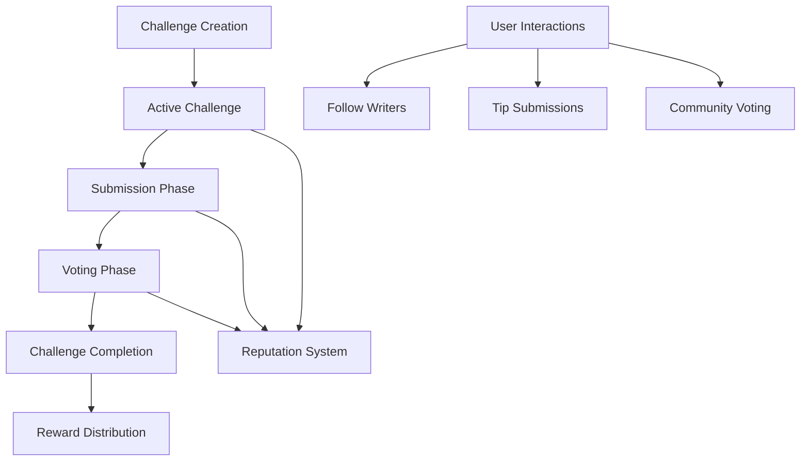

# PredictReview: Community-Driven Creative Writing Platform

A decentralized ecosystem for creative writers to challenge themselves, earn rewards, and build reputation through blockchain-powered community engagement.

## Overview

PredictReview reimagines creative writing as a dynamic, interactive experience where:
- Writers compete in themed challenges across diverse genres
- Community members vote and provide feedback
- Top contributors earn tangible rewards
- Participants build genre-specific reputations

## Key Innovation

Our platform leverages blockchain technology to ensure:
- Transparent challenge and voting mechanisms
- Verifiable content ownership
- Fair, algorithmic reward distribution
- Immutable creative work attribution

## Platform Architecture



### Core Components
- Challenge Management
- Submission Tracking
- Community Voting System
- Meritocratic Rewards
- Writer Reputation Mechanism
- Social Discovery Features

## Smart Contract: review-challenge.clar

The primary Clarity smart contract powering PredictReview's core functionality.

### Key Features
- Decentralized challenge creation
- Secure work submissions
- Transparent voting process
- Algorithmic reward distribution
- Genre-based reputation tracking
- Social interaction primitives

### Access Control
- Challenge Creators: Initiate and finalize challenges
- Writers: Submit and claim works
- Community Members: Vote and provide tips
- Platform Admin: Manage contract parameters

## Getting Started

### Prerequisites
- Clarinet CLI
- Stacks-compatible wallet

### Quick Examples

1. Create a Writing Challenge:
```clarity
(contract-call? .review-challenge create-challenge 
    "Summer Story Sprint" 
    "Craft a compelling summer narrative" 
    "fiction" 
    u43200   ; Challenge duration 
    u43200   ; Voting period
    u100000  ; Submission fee
    u1000000 ; Stake
)
```

2. Submit a Work:
```clarity
(contract-call? .review-challenge submit-work 
    u1        ; Challenge ID
    "Sunset's Promise"  ; Work title
    0x...)   ; Content hash
```

3. Vote on a Submission:
```clarity
(contract-call? .review-challenge vote-for-submission u1)
```

## Development

### Testing
1. Clone repository
2. `clarinet install`
3. `clarinet test`

### Local Deployment
1. `clarinet console`
2. Deploy and interact with contract

## Security & Tokenomics

### Platform Limits
- 100 max submissions per challenge
- 100 max votes per user
- Challenge duration: 12h to 6 months

### Economic Model
- Challenge Creation: 1 STX
- Submission Fee: 0.1 STX
- Platform Fee: 5%
- Reward Distribution:
  - 1st Place: 50%
  - 2nd Place: 30%
  - 3rd Place: 15%
  - Challenge Creator: 5%

## Community Guidelines
- Respect intellectual property
- Provide constructive feedback
- Maintain high-quality submissions
- Engage ethically in voting